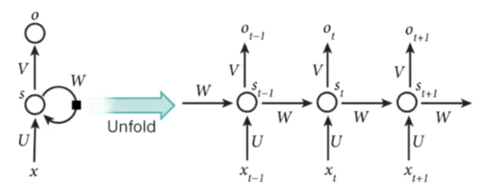

The **Attention mechanism** was first proposed in the visual field. In 2014, Google Mind published "Recurrent Models of Visual Attention", which made the Attention mechanism popular. This paper uses the RNN model and adds the Attention mechanism to classify images. In 205, in the paper "Neural Machine Translation by Jointly Learning to Align and Translate", Bahdanau et al. applied the attention mechanism to the nlp field for the first time. They used the Seq2Seq+Attention model for machine translation, and the effect was improved. Seq2Seq Introduced in With Attention. In 2017, the "Attention is All You Need" published by the Google machine translation team completely abandoned network structures such as RNN and CNN, and only used the Attention mechanism for machine translation tasks, and achieved good results. 

### Related knowledge concepts
- RNN

- LSTM
  The full name of LSTM is Long Short Term Memory networks, which is a special form of RNN, which is characterized by the ability to learn long-distance dependencies.
- GRU
- Word Embedding
  - Word2Vec
    Word2Vec is an efficient training word proposed by Tomas Mikolov et al. in the Google research team in "Distributed Representations of Words and Phrases and their Compositionality" in 2013 and the subsequent "Efficient Estimation of Word Representations in Vector Space". The basic starting point of the vector model is similar to the distributed representation: two words with similar contexts should have similar word vectors.

  - BERT
    (Bidirectional Encoder Representation from Transformers)  BERT uses the Transformer Encoder block for connection, which is a typical two-way encoding model.

---

